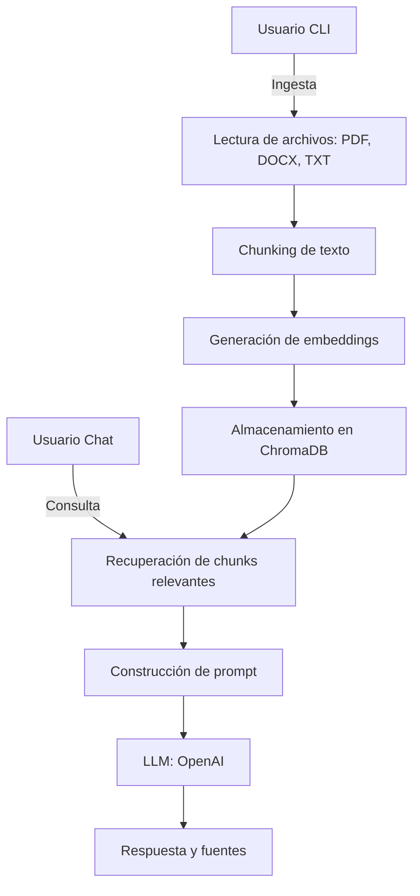

# RAGent

[](https://deepwiki.com/TheRamdomX/RAGent)
[](https://www.python.org/)
[](https://www.langchain.com/)
[](https://openai.com/)
[](https://www.trychroma.com/)
[](https://pypi.org/project/PyPDF2/)
[](https://pypi.org/project/python-docx/)
[](https://github.com/openai/tiktoken)
[](https://pypi.org/project/marker-pdf/)
[](https://pypi.org/project/python-dotenv/)

RAGent es un asistente conversacional basado en RAG (Retrieval-Augmented Generation) que responde preguntas utilizando información extraída de documentos (PDF, DOCX, TXT) y modelos de lenguaje (LLM). El sistema ingiere archivos, los procesa en chunks, genera embeddings, almacena los vectores en una base ChromaDB y utiliza un modelo LLM para responder preguntas apoyándose en el contexto recuperado.

## Flujo de datos

### Ingesta de archivos

1. El usuario ingresa archivos mediante la CLI ([main.py](main.py), [ingestion.py](app/data/ingestion.py)).

2. Los archivos se leen y procesan (PDF, DOCX, TXT).

3. El texto se divide en chunks ([chunking.py](app/data/chunking.py)).

4. Se generan embeddings para cada chunk ([embeddings.py](app/models/embeddings.py)).

5. Los chunks y sus embeddings se almacenan en ChromaDB.

### Recuperación y respuesta

1. El usuario realiza una consulta en el chat.

2. El sistema recupera los chunks más relevantes desde ChromaDB usando embeddings ([retriever.py](app/rag/retriever.py)).

3. Opcionalmente, un agente ReAct (`app/rag/ReAct.py`) puede orquestar el proceso: invocar la herramienta `RAG_Search` para recuperar evidencia, razonar con el LLM y enriquecer la respuesta.

4. Se construye un prompt con el contexto recuperado y la pregunta del usuario ([qa.py](app/rag/qa.py)).

5. El prompt se envía al modelo LLM para generar una respuesta ([llm.py](app/models/llm.py)).

6. Se muestra la respuesta y las fuentes relevantes al usuario.

### Gestión de la conversación

1. Se mantiene un historial de turnos (usuario/asistente) ([conversation.py](app/controllers/conversation.py), [chatbot.py](app/chatbot.py)).

2. Se puede alternar entre modo RAG y modo LLM puro.

## Diagrama de flujo de datos



## Componentes principales

- [main.py](main.py): CLI para ingesta y ejecución.
- [app/data/ingestion.py](app/data/ingestion.py): Procesamiento de archivos y chunks.
- [app/models/embeddings.py](app/models/embeddings.py): Generación de embeddings.
- [app/rag/retriever.py](app/rag/retriever.py): Recuperación de contexto relevante.
- [app/rag/qa.py](app/rag/qa.py): Construcción de prompts y respuestas.
- [app/rag/ReAct.py](app/rag/ReAct.py): Agente ReAct que orquesta razonamiento y llamadas a la herramienta RAG.
- [app/models/llm.py](app/models/llm.py): Interfaz con el modelo LLM.
- [app/controllers/conversation.py](app/controllers/conversation.py): Gestión del historial conversacional.
- [app/chatbot.py](app/chatbot.py): Interfaz de chat.

## Uso básico (CLI)

- Ingesta de archivos:
```
    python main.py ingest docs/algebra.pdf docs/notes.docx 
```
- Modo chat:
```
    python main.py chat
```
- Ingesta + chat en un solo paso:
```
    python main.py run file.pdf 
```
- Listar archivos del RAG
```
    python main.py list
```
- Eliminar archivos del RAG
```
    python main.py delete file.pdf 
```
## Configuración (variables de entorno)

RAGent se configura principalmente mediante variables de entorno (usando `.env`). Las más relevantes:

- `OPENAI_API_KEY` — Clave de OpenAI para embeddings y LLM.
- `CHROMA_PERSIST_DIR` — Directorio donde se persiste la base ChromaDB (por defecto `./chroma_db`).
- `EMBEDDING_MODEL` — Modelo de embeddings (por defecto `text-embedding-3-small`).
- `LLM_MODEL` — Modelo LLM para generación (por defecto `gpt-4.1-nano`).
- `DEFAULT_TOP_K` — Número por defecto de documentos a recuperar en búsquedas.

- OCR y extracción de PDFs:
    - `FORCE_MARKER_OCR` — Si es `true`, el sistema intentará usar Marker OCR en PDFs cuando la extracción nativa devuelva poco texto.
    - `MARKER_OCR_THRESHOLD` — Umbral en caracteres para decidir cuando la extracción nativa se considera "pobre" (por defecto 500).

- Chunking y deduplicación:
    - `CHUNK_DEFAULT_SIZE` — Tamaño por defecto del chunk en caracteres (por defecto 1000).
    - `CHUNK_DEFAULT_OVERLAP` — Solapamiento entre chunks en caracteres (por defecto 200).
    - `MIN_CHUNK_CHARS` — Longitud mínima aceptable para un chunk (por defecto 50).
    - `DEDUP_SIM_THRESHOLD` — Umbral de similitud para marcar near-duplicates usando embeddings (0..1, por defecto 0.9).

- LLM / Agentes:
    - `LLM_TEMPERATURE` — Controla creatividad/determinismo del LLM (0.0 a 1.0, por defecto 0.7).
    - `LLM_MAX_COMPLETION_TOKENS` — Tokens máximos por respuesta del LLM.
    - `BUDGET_CALLS_PER_QUERY` — Límite de llamadas a herramientas por consulta en agentes (por defecto 5).

## Notas sobre OCR

La extracción estándar de PDFs (PyPDF2) se usa por defecto. Si la extracción nativa devuelve menos caracteres que `MARKER_OCR_THRESHOLD` y `FORCE_MARKER_OCR=true`, el sistema llamará a Marker OCR para intentar una extracción más robusta (útil para PDFs escaneados). Los errores en OCR no son capturados silenciosamente — se propagan para facilitar debugging.
