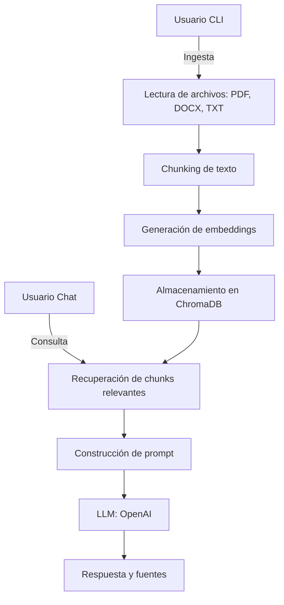

# RAGent

RAGent es un asistente conversacional basado en RAG (Retrieval-Augmented Generation) que responde preguntas utilizando información extraída de documentos (PDF, DOCX, TXT) y modelos de lenguaje (LLM). El sistema ingiere archivos, los procesa en chunks, genera embeddings, almacena los vectores en una base ChromaDB y utiliza un modelo LLM para responder preguntas apoyándose en el contexto recuperado.

## Flujo de datos

### Ingesta de archivos

1. El usuario ingresa archivos mediante la CLI ([main.py](main.py), [ingestion.py](app/data/ingestion.py)).

2. Los archivos se leen y procesan (PDF, DOCX, TXT).

3. El texto se divide en chunks ([chunking.py](app/data/chunking.py)).

4. Se generan embeddings para cada chunk ([embeddings.py](app/models/embeddings.py)).

5. Los chunks y sus embeddings se almacenan en ChromaDB.

### Recuperación y respuesta

1. El usuario realiza una consulta en el chat.

2. El sistema recupera los chunks más relevantes desde ChromaDB usando embeddings ([retriever.py](app/rag/retriever.py)).

3. Se construye un prompt con el contexto recuperado y la pregunta del usuario ([qa.py](app/rag/qa.py)).

4. El prompt se envía al modelo LLM para generar una respuesta ([llm.py](app/models/llm.py)).

5. Se muestra la respuesta y las fuentes relevantes al usuario.

### Gestión de la conversación

1. Se mantiene un historial de turnos (usuario/asistente) ([conversation.py](app/controllers/conversation.py), [chatbot.py](app/chatbot.py)).

2. Se puede alternar entre modo RAG y modo LLM puro.

## Diagrama de flujo de datos

## Componentes principales

- [main.py](main.py): CLI para ingesta y ejecución.
- [app/data/ingestion.py](app/data/ingestion.py): Procesamiento de archivos y chunks.
- [app/models/embeddings.py](app/models/embeddings.py): Generación de embeddings.
- [app/rag/retriever.py](app/rag/retriever.py): Recuperación de contexto relevante.
- [app/rag/qa.py](app/rag/qa.py): Construcción de prompts y respuestas.
- [app/models/llm.py](app/models/llm.py): Interfaz con el modelo LLM.
- [app/controllers/conversation.py](app/controllers/conversation.py): Gestión del historial conversacional.
- [app/chatbot.py](app/chatbot.py): Interfaz de chat.

## Requisitos

Consulta el archivo [requirements.txt](requirements.txt) para dependencias necesarias.

## Ejecución

1. Instala las dependencias: `pip install -r requirements.txt`

2. Configura tu archivo [.env](.env) con las claves necesarias (OpenAI, etc).

3. Ingresa documentos usando la CLI: `python main.py ingest files/mi_documento.pdf`

4. Inicia el chat: `python main.py run`